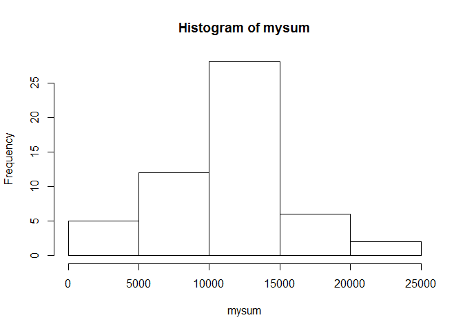
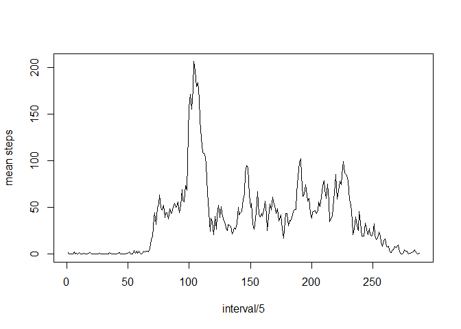
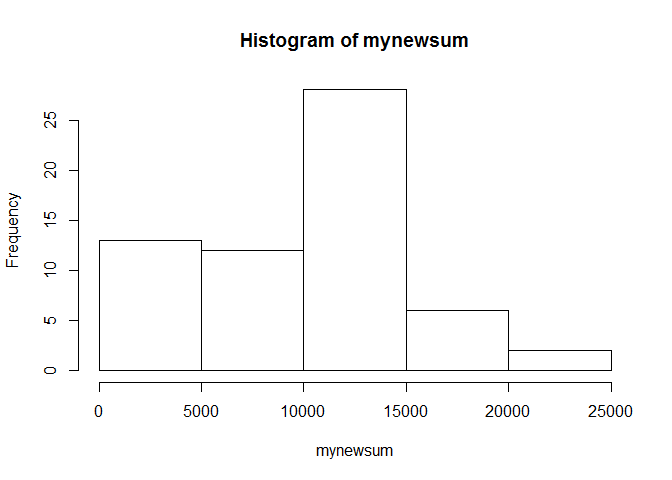
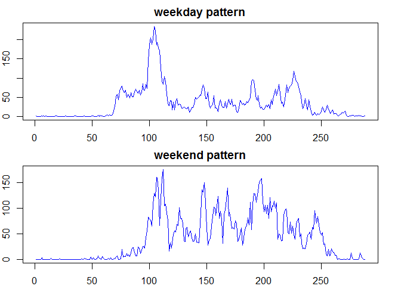

# Reproducible Research: Peer Assessment 1


## Loading and preprocessing the data

```r
  dat<-read.csv("activity.csv")
  dat2<-na.omit(dat)
  mysum<-tapply(dat$steps,dat$date,sum)
  mysteps<-as.numeric(mysum)
```

## What is mean total number of steps taken per day?
*Make a histogram of the total number of steps taken each day:

```r
  hist(mysum)
```

<!-- -->

*Mean total number of steps taken per day is: 

```r
  themean<-mean(mysteps,na.rm=TRUE)
  themean
```

```
## [1] 10766.19
```
*Median total number of steps take per day is:

```r
  median(mysteps,na.rm=TRUE)
```

```
## [1] 10765
```

## What is the average daily activity pattern?
* Answer : 

```r
  thepattern<-tapply(dat2$steps,dat2$interval,mean)
  plot(thepattern,xlab="interval/5",ylab="mean steps",type="l")
```

<!-- -->
*Which 5-minute interval, on average across all the days in the dataset, contains the maximum number of steps:

```r
  names(thepattern[order(thepattern,decreasing=TRUE)[1]])
```

```
## [1] "835"
```
## Imputing missing values
*Calculate and report the total number of missing values in the dataset:

```r
  sum(is.na(dat$steps))
```

```
## [1] 2304
```
*Create a new dataset that is equal to the original dataset but with the missing data filled in:

```r
  newdat<-dat
  newdat$steps[is.na(newdat$steps)]<-themean/sum(is.na(newdat$steps))
```
*Make a histogram of the total number of steps taken each day and Calculate and report the mean and median total number of steps taken per day

```r
  mynewsum<-tapply(newdat$steps,newdat$date,sum)
  hist(mynewsum)
```

<!-- -->

## Are there differences in activity patterns between weekdays and weekends?
*Create a new factor variable in the dataset with two levels – “weekday” and “weekend” indicating whether a given date is a weekday or weekend day:

```r
  dat$weekdays<-weekdays(as.Date(as.character(dat$date)))
  dat$weekdays<-ifelse(dat$weekdays=="星期日" |dat$weekdays=="星期六","weekend","weekday")
  dat$weekdays<-as.factor(dat$weekdays)
```

*Make a panel plot containing a time series plot (i.e. type = "l") of the 5-minute interval (x-axis) and the average number of steps taken, averaged across all weekday days or weekend days (y-axis). 

```r
  weekday<-subset(dat,weekdays=="weekday")
  weekend<-subset(dat,weekdays=="weekend")
  weekday<-na.omit(weekday)
  weekend<-na.omit(weekend)
  thepattern_weekday<-tapply(weekday$steps,weekday$interval,mean)
  thepattern_weekend<-tapply(weekend$steps,weekend$interval,mean)
  par(mfrow=c(2,1),mar=c(2,2,2,2))
  plot(thepattern_weekday,type="l",col="blue",xlab="interval/5",ylab="steps",main="weekday pattern")
  plot(thepattern_weekend,type="l",col="blue",xlab="interval/5",ylab="steps",main="weekend pattern")
```

<!-- -->
